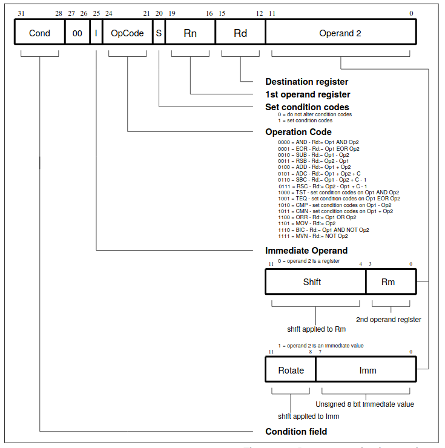
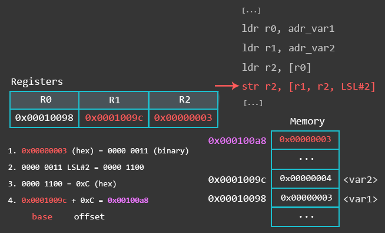

.. _assembly-top:

********
Assembly
********

Table of content
################

..
    todo: Table of content

Introduction
############

In this part of the course we will take a look at the ARM assembly intruction set and internal arhitecture of the ARM CPU.

ARM-32 Registers
################
For the purposes of the normal programmer in "User Mode" the ARM has 15 registers. R0-R12 are free for us to do whatever we want, R13 is the Stack Pointer (also addressable as SP), R15 is the Program Counter (PC)

R14 may be surprising to those familiar with other CPUs, when we call a subroutine (With BL - Branch and Link) the return address is not pushed onto the stack, instead it's moved into R14/LR... to return from the subroutine we need to move the R14/LR register into R15/PC.

This poses a problem, as nesting subroutines will lose the return value, if this is needed, the best solution is to simply push R14/LR onto the stack at the start of a sub, and pop PC/R15 off the stack at the end.

.. list-table:: ARM CPU register map
    :widths: 25 125 50
    :header-rows: 1
    
    *   - 
        - 32b registers
        - Use case
    *   - R0
        - R0
        - 
    *   - R1
        - R1
        - 
    *   - R2
        - R2
        - 
    *   - R3
        - R3
        - 
    *   - R4
        - R4
        - 
    *   - R5
        - R5
        - 
    *   - R6
        - R6
        - 
    *   - R7
        - R7
        - 
    *   - R8
        - R8
        - 
    *   - R9
        - R9
        - 
    *   - R10
        - R10
        - 
    *   - R11
        - R11/FP
        - Frame Pointer (Optional)
    *   - R12
        - R12/IP
        - Intra Procedure Call (Optional)
    *   - R13
        - SP
        - Stack Pointer
    *   - R14
        - LR/LK
        - Link register
    *   - R15
        - PC
        - System program counter

The Application Program Status Register (APSR) holds copies of the Arithmetic Logic Unit (ALU) status flags. They are also known as the condition code flags. They are used to determine whether conditional instructions are executed or not.

.. image:: images/arm-xpsr-register.png

where:

    N
        Negative condition flag. Set to bit[31] of the result of the instruction. If the result is regarded as a two's complement signed integer, then the processor sets N to 1 if the result is negative, and sets N to 0 if it is positive or zero.
        
    Z
        Zero condition flag. Set to 1 if the result of the instruction is zero, and to 0 otherwise. A result of zero often indicates an equal result from a comparison.
        
    C
        Carry condition flag. Set to 1 if the instruction results in a carry condition, for example an unsigned overflow on an addition.
    
    V
        Overflow condition flag. Set to 1 if the instruction results in an overflow condition, for example a signed overflow on an addition.
        
    Q
        Set to 1 to indicate overflow or saturation occurred in some instructions, normally related to digital signal processing (DSP)
        
    GE
        The Greater than or Equal flags 

ARM Instruction set
###################

Syntax
======
General syntax of the ARM instruction is:
.. code-block::
 
    <op><cc><S> 	Rd, <operands>
    
where:

    op
        is ARM instruction 

    cc
        is compare flag
    
    S

    Rd 
        destination register 
    
    operands
        arguments for the instruction 
        
        

Following images describes format of the ARM instruction.

Data processing
===============

MOV
---

MOV instruction is used for loading the immediate value to register and for copying value from one register to another. Basic sytanx of the MOV instruction is:
.. code-block::
    
    mov destination,source

**Loading the immediate value**

.. code-block::
    
    mov  r0,#0x1234			; load value 0x1234 to register r0
    mov  r1,#56				; load value 56 to register r1
    mov  r2,#0x12340000		; this will generate compiler error because we can only load 2 bytes using the MOV instruction

**Coppying value from one register to another**

.. code-block::

    mov r0,pc				; this will coppy value from the PC  to register r0

As we saw before, we can't load to register immediate value greater than 2 bytes.   At least, we can't achive this with only one instruction. But there is workaround. We can use left shift  to get desired value stored in the register. But this value that will be shifted must be stored in the internal register first.

**Loading the immediate value larger then 2 bytes**

.. code-block::
    
    mov  r0,#0x1234			; load value 0x1234 to register r0
    mov  r1,r0,LSL 4			; load value 56 to register r1

MVN
---
This instruction works just like the **MOV** instruction, but instead of loading the provided value to the destination register, this instruction will load first complement of the specified value. For example, instruction

.. code-block::
    
    mvn r0,#0x00FF

will load value *#0xff00* to the register *r0.*

ADD
---

Basic sytanx of the ADD instruction is:
.. code-block::
    
    add 		r0,r1		; r0 = r0 + r1
    add 		r0,r0,r1 	; r0= r0 + r1
    adc 		r0,r1		; r0 = r0 + r1 + C

This instruction will add values from two registers and move them to destination register. We have special case when one of the operands is also the destination register. In this case we can only specify destination register and we don't need to specify second operand because this operans is value from the destination register.

Addin sufix c to this command will take in consideration the value of the carry flag.

SUB
---

Basic sytanx of the SUB instruction is:

.. code-block::
    
    sub 		r0,r1		; r0 = r0 - r1
    sub			r0,r0,r1 	; r0= r0 - r1
    sbc 		r0,r1		; r0 = r0 - r1 - !C

This instruction will add values from two registers and move them to destination register. We have special case when one of the operands is also the destination register. In this case we can only specify destination register and we don't need to specify second operand because this operans is value from the destination register.

Addin sufix c to this command will take in consideration the value of the carry flag.

RSB
---

This instruction works just like the SUB instruction. Only differenc is that the position of operans are swapped.
Basic sytanx of the RSB instruction is:

.. code-block::
    
    rsb 		r0,r1		; r0 = r1 - r0
    rsb			r0,r0,r1 		; r0= r1 - r0

Bitwise operation
-----------------
Following bitwise operations are supported.

.. code-block::
    
    and 				r0,r1,r2		;r0 = r1 & r2
    orr				r0,r1,r2		;r0 = r1 | r2
    eor				r0,r1,r2		;r0 = r1 ^ r2
    bic 				r0,r1,r2		;r0 = r1 & (~r2)

Comparison operations
=====================

Basic sytanx for comparison instruction is

.. code-block::
    
    <op><cc> Rn,Operand2

We can use following operations:

    CMP
        Compare (Flags set to result of (Rn − Operand2))

    CMN
        Compare negative (Flags set to result of (Rn + Operand2))

    TST
        bitwise test (Flags set to result of (Rn AND Operand2).)

    TEQ
        test equivalence (Flags set to result of (Rn EOR Operand2))

Comparisons produce no results – they just set condition codes. Ordinary instructions will also set condition codes if the “S” bit is set. The “S” bit is implied for comparison instructions.

These instructions update the N, Z, C. For example, the CMP instruction will set the confition codes as follows:

    N = 1 
        if the most significant bit of (r1 - r2) is 1, i.e. r2 > r1 </li>
    
    Z = 1 
        if (r1 - r2) = 0, i.e. r1 = r2 </li>
    
    C = 1 
        if r1 and r2 are both unsigned integers AND (r1 < r2) </li>
        
    V = 1 
        if r1 and r2 are both signed integers AND (r1 < r2)</li>

Instructions **TST** and **TEQ** will not affect C flag and this flag will keep previous value.

The following table lists the available condition codes, their meanings, and the status of the flags that are tested.

.. list-table:: Available condition codes
    :widths: 25 125 50
    :header-rows: 1
    
    *   - Condition code
        - Meaning (for cmp or subs)
        - Status of Flags
    *   - EQ
        - Equal
        - Z=1
    *   - NEQ
        - Not Equal
        - Z=0
    *   - GT
        - Signed Greater Than
        - (Z = 0) && (N = V)
    *   - LT
        - Signel Less Than
        - N != V
    *   - GE
        - Signed Greater Thanor Equal
        - N = V
    *   - LE
        - Signel Less Than or Equal
        - (Z = 1) || (N != V)
    *   - CS or HS
        - Unsigned Higher or Same (or Carry Set)
        - C=1
    *   - CC or LO
        - Unisgned Lower (or Carry Clear)
        - C=0
    *   - MI
        - Negative (or Minus)
        - N = 1  
    *   - PL
        - Positiv (or Plus)
        - N = 0
    *   - AL
        - Always executed
        - 
    *   - NV
        - Never executed
        - 
    *   - VS
        - Signed overflow
        - V = 1
    *   - VC
        - No signed overflow
        - V = 0
    *   - HI
        - Unsigned Higher
        - (C = 1) && (Z = 0)
    *   - LS
        - Unsigned lower or same
        - (C = 0) || (Z = 0)

Flow control
============

Branching
---------

For the flow control we can use following instructions:

.. code:block::

    b <cond> 	label	; jump to the label subroutine
    bl <cond> 	label	; coppy address of the next instruction to the LR and jump to the label subroutine
    bx<cond>	label	; coppy content of the LR to PC (this is euqal to return from subroutine)

Conditional eqecution
---------------------

Syntax: 

.. code-block::
    
    IT{x{y{z}}} cond

where:
    * cond - specifies the condition for the first instruction in the IT block
    * x - specifies the condition switch for the second instruction in the IT block
    * y - specifies the condition switch for the third instruction in the IT block
    * z - specifies the condition switch for the fourth instruction in the IT block

The structure of the IT instruction is “IF-Then-(Else)” and the syntax is a construct of the two letters T and E:

    * IT refers to If-Then (next instruction is conditional)
    * ITT refers to If-Then-Then (next 2 instructions are conditional)
    * ITE refers to If-Then-Else (next 2 instructions are conditional)
    * ITTE refers to If-Then-Then-Else (next 3 instructions are conditional)
    * ITTEE refers to If-Then-Then-Else-Else (next 4 instructions are conditional)

Each instruction inside the IT block must specify a condition suffix that is either the same or logical inverse. This means that if you use ITE, the first and second instruction (If-Then) must have the same condition suffix and the third (Else) must have the logical inverse of the first two. Here are some examples from the ARM reference manual which illustrates this logic:

.. code-block::

    ITTE   NE           ; Next 3 instructions are conditional
    ANDNE  R0, R0, R1   ; ANDNE does not update condition flags
    ADDSNE R2, R2, #1   ; ADDSNE updates condition flags
    MOVEQ  R2, R3       ; Conditional move
    
    ITE    GT           ; Next 2 instructions are conditional
    ADDGT  R1, R0, #55  ; Conditional addition in case the GT is true
    ADDLE  R1, R0, #48  ; Conditional addition in case the GT is not true
    
    ITTEE  EQ           ; Next 4 instructions are conditional
    MOVEQ  R0, R1       ; Conditional MOV
    ADDEQ  R2, R2, #10  ; Conditional ADD
    ANDNE  R3, R3, #1   ; Conditional AND
    BNE.W  dloop        ; Branch instruction can only be used in the last instruction of an IT block

Wrong syntax:

.. code-block::

    IT     NE           ; Next instruction is conditional
    ADD    R0, R0, R1   ; Syntax error: no condition code used in IT block.

Here are the conditional codes and theire opposite:

.. raw:: html

    <table>
    <thead><tr><th title="Field #1" colspan="2">Condition Code</th>
    <th title="Field #2" colspan="2">Opposite</th>
    </tr></thead>
    <tbody><tr>
    <td>Code </td>
    <td>	Meaning</td>
    <td> 	Code </td>
    <td>	Meaning</td>
    </tr>
    <tr>
    <td>EQ 	</td>
    <td>Equal </td>
    <td>	NE </td>
    <td>	 Not Equal</td>
    </tr>
    <tr>
    <td>HS(or CS) </td>
    <td>	Unsigned higher or same(or carry set) </td>
    <td>	LO(or CC) </td>
    <td>	 Unsigned lower (or carry clear)</td>
    </tr>
    <tr>
    <td>MI </td>
    <td>	Negative </td>
    <td>	PL 	</td>
    <td> Positive or Zero</td>
    </tr>
    <tr>
    <td>VS </td>
    <td>	Signed Overflow</td>
    <td> 	VC 	 </td>
    <td>No Signed Overflow</td>
    </tr>
    <tr>
    <td>HI </td>
    <td>	Unsigned Higher </td>
    <td>	LS 	</td>
    <td> Unsigned Lower or Same</td>
    </tr>
    <tr>
    <td>GE </td>
    <td>	Signed Greater Than or Equal </td>
    <td>	LT 	</td>
    <td> Signed Less Than</td>
    </tr>
    <tr>
    <td>GT </td>
    <td>	 Signed Greater Than</td>
    <td> 	LE </td>
    <td>	 Signed Less Than or Equal</td>
    </tr>
    <tr>
    <td>AL(or omitted)</td>
    <td> 	 Always Executed </td>
    <td colspan="2">	There is no opposite to AL</td>
    </tr>
    </tbody></table>

Memory Instructions
===================

ARM uses a load-store model for memory access which means that only load/store (LDR and STR) instructions can access memory. While on x86 most instructions are allowed to directly operate on data in memory, on ARM data must be moved from memory into registers before being operated on. This means that incrementing a 32-bit value at a particular memory address on ARM would require three types of instructions (load, increment, and store) to first load the value at a particular address into a register, increment it within the register, and store it back to the memory from the register.

Addressing mode
---------------

ARM arhitecture supports 3 addressing modes:    
    * Immediate
    * Register
    * Scaled register

These addressing modes can affect the value in the base register in three different ways:

    * **Offset**    - The value in the base register is unchanged.
    * **Pre-indexed**   -  The offset is combined with the value in the base - register, and the base register is updated with this new address before being used to access memory.
    * **Post-indexed**  -  The value in the base register alone is used to access memory. Then the the offset is combined with the value in the base register, and the base register is updated with this new address after accessing memory.

Load and Store Instruction
--------------------------

Generally, LDR is used to load something from memory into a register, and STR is used to store something from a register to a memory address.

This is how it would look like in a functional assembly program:

At the bottom we have our Literal Pool (a memory area in the same code section to store constants, strings, or offsets that others can reference in a position-independent manner) where we store the memory addresses of var1 and var2 (defined in the data section at the top) using the labels adr_var1 and adr_var2. The first LDR loads the address of var1 into register R0. The second LDR does the same for var2 and loads it to R1. Then we load the value stored at the memory address found in R0 to R2, and store the value found in R2 to the memory address found in R1.

When we load something into a register, the brackets ([ ]) mean: the value found in the register between these brackets is a memory address we want to load something from.

When we store something to a memory location, the brackets ([ ]) mean: the value found in the register between these brackets is a memory address we want to store something to.

This sounds more complicated than it actually is, so here is a visual representation of what’s going on with the memory and the registers when executing the code above in a debugger:

The use of an equals sign (=) at the start of the second operand of the LDR instruction indicates the use of the LDR pseudo-instruction. This pseuo-instruction is used to load an arbitrary 32-bit constant value into a register with a single instruction despite the fact that the ARM instruction set only supports immediate values in a much smaller range.

If the value after the = is known by the assembler and fits in with the allowed range of an immediate value for the MOV or MVN instruction then a MOV or MVN instruction is generated. Otherwise the constant value is put into the literal pool, and a PC-relative LDR instruction is used to load the value into the register.

**Offset form: Immediate value as the offset**

.. code-block::

    STR    Ra, [Rb, imm]
    LDR    Ra, [Rc, imm]

Here we use an immediate (integer) as an offset. This value is added or subtracted from the base register (R1 in the example below) to access data at an offset known at compile time.

.. code-block::

	ldr r0, adr_var1  @ load the memory address of var1 via label adr_var1 into R0
	ldr r1, adr_var2  @ load the memory address of var2 via label adr_var2 into R1
	ldr r2, [r0]      @ load the value (0x03) at memory address found in R0 to register R2
	str r2, [r1, #2]  @ address mode: offset. Store the value found in R2 (0x03) to the memory address found in R1 plus 2. Base register (R1) unmodified.
	str r2, [r1, #4]! @ address mode: pre-indexed. Store the value found in R2 (0x03) to the memory address found in R1 plus 4. Base register (R1) modified: R1 = R1+4
	ldr r3, [r1], #4  @ address mode: post-indexed. Load the value at memory address found in R1 to register R3. Base register (R1) modified: R1 = R1+4

Visual representation of above code:

.. image:: images/arm-load-store-offset-im.gif

**Offset form: Register as the offset**

.. code-block::

    STR    Ra, [Rb, Rc]
    LDR    Ra, [Rb, Rc]

This offset form uses a register as an offset. An example usage of this offset form is when your code wants to access an array where the index is computed at run-time.

.. code-block::
	ldr r0, adr_var1  @ load the memory address of var1 via label adr_var1 to R0 
    ldr r1, adr_var2  @ load the memory address of var2 via label adr_var2 to R1 
    ldr r2, [r0]      @ load the value (0x03) at memory address found in R0 to R2
    str r2, [r1, r2]  @ address mode: offset. Store the value found in R2 (0x03) to the memory address found in R1 with the offset R2 (0x03). Base register unmodified.   
    @pre-index and post-indexed don't work in .thumb mode
    str r2, [r1, r2]! @ address mode: pre-indexed. Store value found in R2 (0x03) to the memory address found in R1 with the offset R2 (0x03). Base register modified: R1 = R1+R2. 
    ldr r3, [r1], r2  @ address mode: post-indexed. Load value at memory address found in R1 to register R3. Then modify base register: R1 = R1+R2.

Visual representation of the above code:

.. image:: images/arm-load-store-offset-ref.gif

**Offset form: Scaled register as the offset**
.. code-block:: 
    LDR    Ra, [Rb, Rc, <shifter>]
    STR    Ra, [Rb, Rc, <shifter>]

The third offset form has a scaled register as the offset. In this case, Rb is the base register and Rc is an immediate offset (or a register containing an immediate value) left/right shifted (<shifter>) to scale the immediate.
This means that the barrel shifter is used to scale the offset. An example usage of this offset form would be for loops to iterate over an array. 

.. code-block::
	ldr r0, adr_var1         @ load the memory address of var1 via label adr_var1 to R0
    ldr r1, adr_var2         @ load the memory address of var2 via label adr_var2 to R1
    ldr r2, [r0]             @ load the value (0x03) at memory address found in R0 to R2
    str r2, [r1, r2, LSL#2]  @ address mode: offset. Store the value found in R2 (0x03) to the memory address found in R1 with the offset R2 left-shifted by 2. Base register (R1) unmodified.
    str r2, [r1, r2, LSL#2]! @ address mode: pre-indexed. Store the value found in R2 (0x03) to the memory address found in R1 with the offset R2 left-shifted by 2. Base register modified: R1 = R1 + R2<<2
    ldr r3, [r1], r2, LSL#2  @ address mode: post-indexed. Load value at memory address found in R1 to the register R3. Then modifiy base register: R1 = R1 + R2<<2

The first STR operation uses the offset address mode and stores the value found in R2 at the memory location calculated from [r1, r2, LSL#2], which means that it
takes the value in R1 as a base (in this case, R1 contains the memory address of var2), then it takes the value in R2 (0x3), and shifts it left by 2.

The picture below is an attempt to visualize how the memory location is calculated with [r1, r2, LSL#2].

Reference
=========

    1. [Peter Cockerell Book](http://www.peter-cockerell.net/aalp/html/frames.html)
    2. [Azeria Labs](https://azeria-labs.com/writing-arm-assembly-part-1/)
